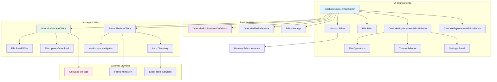
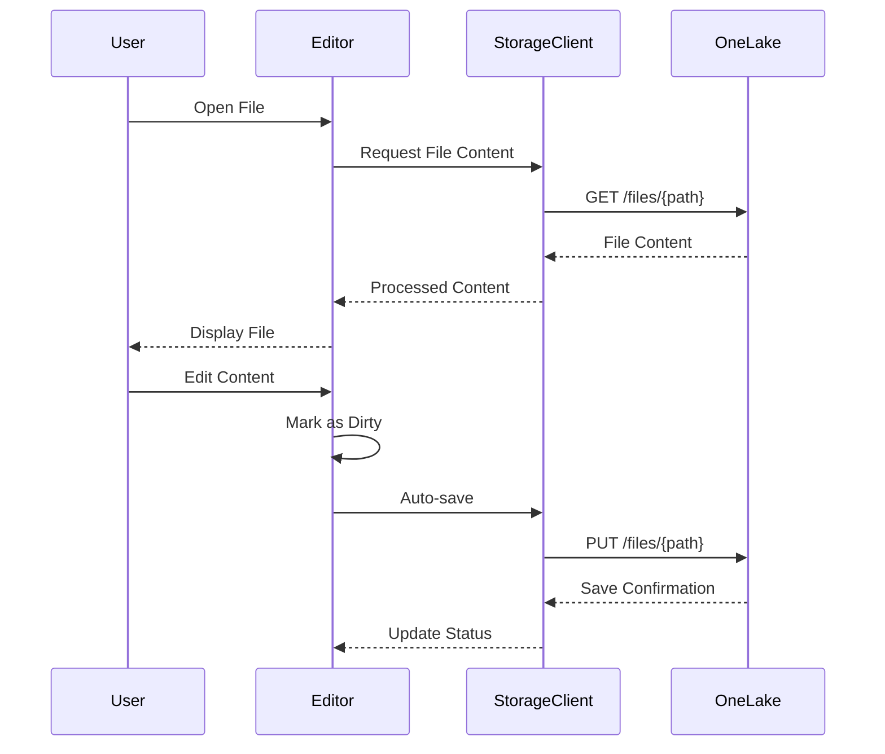
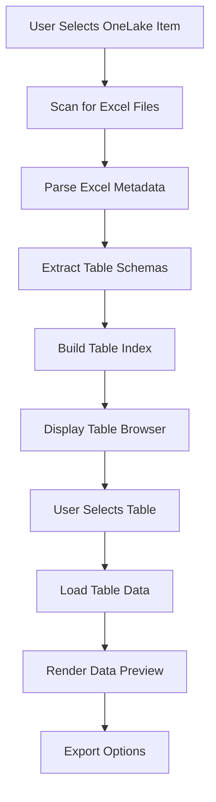

# OneLake Explorer Item - Architecture

## System Architecture



## Component Architecture

### Core Components

#### OneLakeExplorerItemEditor
**Main editor interface providing the primary user experience**

```typescript
interface EditorState {
  isUnsaved: boolean;
  isLoadingData: boolean;
  editorItem: ItemWithDefinition<OneLakeExplorerItemDefinition>;
  isSavingFiles: boolean;
  lastRefreshTime: number;
}
```

**Key Responsibilities:**
- File content management and persistence
- Multi-tab interface for concurrent file editing
- Monaco editor integration and configuration
- OneLake file synchronization
- User interaction handling and state management

#### OneLakeExplorerItemEditorRibbon
**Toolbar and action interface**

**Features:**
- File operations (New, Open, Save, Upload, Download)
- Theme selection and editor customization
- Settings panel for editor preferences
- Integration with Fabric DataHub for file browsing
- Item explorer for OneLake navigation

#### OneLakeExplorerItemEditorEmpty
**Onboarding and empty state interface**

**Capabilities:**
- New file creation workflows
- File upload from local system
- OneLake item browsing and selection
- Getting started guidance and tutorials

### Data Models

#### OneLakeExplorerItemDefinition
**Core data structure for the item's state**

```typescript
interface OneLakeExplorerItemDefinition {
  fileContent?: string;           // Current file content
  language?: string;              // Programming language for syntax highlighting
  fileName?: string;              // Current file name
  theme?: string;                 // Editor theme (vs, vs-dark, hc-black)
  cursorPosition?: {              // Current cursor position
    lineNumber: number;
    column: number;
  };
  openFiles?: OneLakeFileReference[];  // Multi-file tab state
  activeFileIndex?: number;            // Currently active tab
  editorSettings?: EditorSettings;     // User preferences
  itemReference?: Item;                // Selected OneLake item
}
```

#### OneLakeFileReference
**File reference with OneLake integration**

```typescript
interface OneLakeFileReference extends ItemReference {
  onelakeLink: string;    // OneLake path (required)
  fileName: string;       // Display name
  content: string;        // Cached content
  language: string;       // Programming language
  isDirty: boolean;       // Unsaved changes indicator
}
```

## Integration Architecture

### OneLake Storage Integration



### File Type Detection and Language Support

```typescript
class LanguageDetector {
  static detectLanguage(filename: string): string {
    const extensions = {
      '.js': 'javascript',
      '.ts': 'typescript', 
      '.py': 'python',
      '.cs': 'csharp',
      '.json': 'json',
      '.md': 'markdown',
      '.html': 'html',
      '.css': 'css',
      '.sql': 'sql',
      '.yml': 'yaml',
      '.yaml': 'yaml'
    };
    
    const ext = filename.toLowerCase().substring(filename.lastIndexOf('.'));
    return extensions[ext] || 'plaintext';
  }
}
```

## Excel Table Integration Architecture

### Table Discovery Flow



### Table Data Processing

```typescript
interface ExcelTableMetadata {
  tableName: string;
  worksheetName: string;
  range: string;
  columns: TableColumn[];
  rowCount: number;
  dataTypes: ColumnType[];
}

interface TableColumn {
  name: string;
  type: 'string' | 'number' | 'date' | 'boolean';
  nullable: boolean;
  format?: string;
}
```

## Performance Optimization

### File Caching Strategy

```typescript
class FileCache {
  private cache = new Map<string, CachedFile>();
  private maxCacheSize = 50; // Maximum cached files
  
  async getFile(onelakeLink: string): Promise<string> {
    // LRU cache implementation
    if (this.cache.has(onelakeLink)) {
      const cached = this.cache.get(onelakeLink);
      if (this.isValid(cached)) {
        return cached.content;
      }
    }
    
    // Fetch from OneLake and cache
    const content = await this.fetchFromOneLake(onelakeLink);
    this.cache.set(onelakeLink, {
      content,
      timestamp: Date.now(),
      size: content.length
    });
    
    this.evictIfNecessary();
    return content;
  }
}
```

### Monaco Editor Optimization

- **Lazy Loading**: Monaco editor loaded only when needed
- **Language Detection**: Automatic syntax highlighting based on file extension
- **Memory Management**: Disposal of editor instances for closed tabs
- **Debounced Saving**: Auto-save with configurable debounce delay

## Security Architecture

### File Access Control

```typescript
interface FilePermissions {
  canRead: boolean;
  canWrite: boolean;
  canDelete: boolean;
  canShare: boolean;
}

class SecurityManager {
  async validateFileAccess(
    onelakeLink: string, 
    operation: 'read' | 'write' | 'delete'
  ): Promise<boolean> {
    const permissions = await this.getFilePermissions(onelakeLink);
    
    switch (operation) {
      case 'read': return permissions.canRead;
      case 'write': return permissions.canWrite;
      case 'delete': return permissions.canDelete;
      default: return false;
    }
  }
}
```

### Content Sanitization

- **File Type Validation**: Restrict to allowed file extensions
- **Content Scanning**: Validate file content before saving
- **Path Sanitization**: Prevent directory traversal attacks
- **Size Limits**: Enforce maximum file size restrictions

## Error Handling and Recovery

### File Operation Error Handling

```typescript
class FileOperationHandler {
  async saveFile(file: OneLakeFileReference): Promise<boolean> {
    try {
      await this.oneLakeClient.saveFile(file.onelakeLink, file.content);
      file.isDirty = false;
      return true;
    } catch (error) {
      if (error.status === 403) {
        this.notificationService.showError('Permission denied');
      } else if (error.status === 413) {
        this.notificationService.showError('File too large');
      } else {
        this.notificationService.showError('Save failed - changes cached locally');
        this.cacheService.storeLocalCopy(file);
      }
      return false;
    }
  }
}
```

### Recovery Mechanisms

- **Local Caching**: Unsaved changes cached in browser storage
- **Auto-Recovery**: Restore unsaved changes on reload  
- **Conflict Resolution**: Handle concurrent editing scenarios
- **Offline Support**: Basic offline editing with sync on reconnection

## Monitoring and Telemetry

### Performance Metrics
- File load times and caching hit rates
- Editor rendering performance
- OneLake API response times
- Memory usage for large files

### User Analytics
- File type usage patterns
- Feature adoption rates
- Error frequencies and types
- User workflow analysis

## Extensibility Points

### Custom File Handlers
- Plugin architecture for specialized file types
- Custom preview generators
- Integration with external tools
- Workflow automation hooks

### Theme Customization
- Custom Monaco themes
- Brand-specific color schemes
- Accessibility theme options
- User preference persistence