# PackageInstallerItem - Architecture Overview

## System Architecture

```mermaid
graph TB
    subgraph "UI Layer"
        A[PackageInstallerItemEditor] --> B[PackageSelectionView]
        A --> C[DeploymentDetailView]
        A --> D[PackageInstallerItemEditorRibbon]
        A --> E[Settings/About Pages]
    end
    
    subgraph "Core Components"
        F[PackageInstallerItemModel] --> G[PackageInstallerContext]
        H[DeploymentStrategyFactory] --> I[UXDeploymentStrategy]
        H --> J[SparkNotebookDeploymentStrategy]
        H --> K[BaseDeploymentStrategy]
    end
    
    subgraph "Package Management"
        L[PackageCreationStrategyFactory] --> M[BasePackageStrategy]
        N[PackageRegistry] --> O[Package Discovery]
        P[ContentHelper] --> Q[Asset Processing]
    end
    
    subgraph "External Services"
        R[Fabric Platform APIs]
        S[OneLake Storage]
        T[Spark Livy APIs]
        U[Notification Service]
    end
    
    subgraph "Data Models"
        V[Package]
        W[PackageDeployment]
        X[DeployedItem]
        Y[WorkspaceConfig]
    end
    
    A --> F
    A --> G
    A --> H
    G --> R
    G --> S
    I --> R
    J --> T
    M --> S
    P --> S
    A --> U
    F --> V
    F --> W
    F --> X
    F --> Y
    
    style A fill:#e1f5fe
    style F fill:#f3e5f5
    style H fill:#e8f5e8
    style L fill:#fff3e0
    style R fill:#ffebee
    style S fill:#ffebee
```

## Component Breakdown

### UI Layer
- **PackageInstallerItemEditor**: Main editor interface with deployment history table
- **PackageSelectionView**: Interface for selecting and configuring packages
- **DeploymentDetailView**: Real-time deployment monitoring and status display
- **PackageInstallerItemEditorRibbon**: Action buttons and toolbar
- **Settings/About Pages**: Configuration and information pages

### Core Components
- **PackageInstallerItemModel**: TypeScript interfaces and enums defining data structures
- **PackageInstallerContext**: Centralized context providing access to clients and services
- **DeploymentStrategyFactory**: Factory pattern implementation for deployment strategies
- **BaseDeploymentStrategy**: Abstract base class for deployment implementations
- **UXDeploymentStrategy**: Direct API-based deployment for immediate execution
- **SparkNotebookDeploymentStrategy**: Notebook-based deployment using Spark execution

### Package Management
- **PackageCreationStrategyFactory**: Factory for package creation strategies
- **BasePackageStrategy**: Handles automated package creation from Fabric items
- **PackageRegistry**: Manages package discovery and registration
- **ContentHelper**: Utilities for processing assets and content handling

### Data Models
- **Package**: Complete package definition with items, data, and deployment config
- **PackageDeployment**: Individual deployment instance with status and metadata
- **DeployedItem**: Fabric items created during deployment
- **WorkspaceConfig**: Target workspace and folder configuration

### External Services
- **Fabric Platform APIs**: Core Fabric services for item and workspace management
- **OneLake Storage**: Data lake storage for package assets and data files
- **Spark Livy APIs**: Batch job execution for large-scale deployments
- **Notification Service**: User notifications and status updates

## Key Features

### Multi-Strategy Deployment Architecture
The system implements a strategy pattern for deployment approaches:
- **UX Strategy**: Real-time deployment with immediate feedback
- **Spark Strategy**: Asynchronous batch processing for large packages
- **Extensible**: New strategies can be added through the factory pattern

### Flexible Content Handling
- **Asset Payload**: Local files from workload assets
- **Link Payload**: External URLs with CORS handling
- **Inline Base64**: Direct embedded content
- **Binary Support**: Automatic handling of text and binary files

### Workspace Management
- **Create New**: Dynamic workspace creation with capacity assignment
- **Use Existing**: Deploy to existing workspaces with folder organization
- **F-SKU Filtering**: Intelligent workspace filtering based on capabilities

### Real-time Monitoring
- **Status Tracking**: Live deployment status updates
- **Progress Indicators**: Visual progress bars and step-by-step feedback
- **Error Handling**: Comprehensive error reporting and recovery