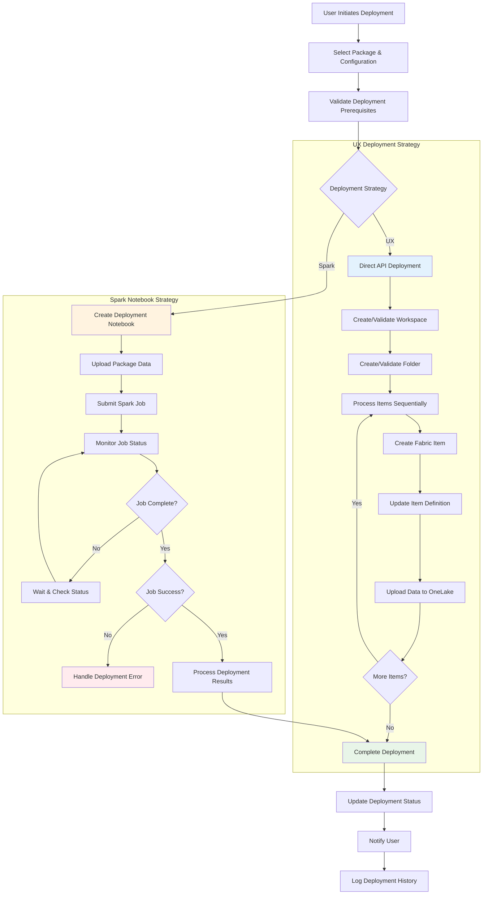
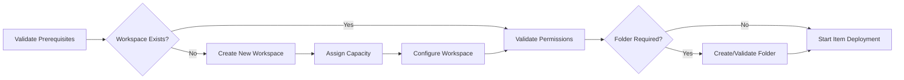
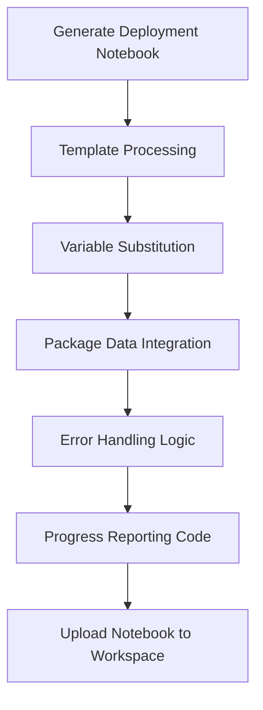
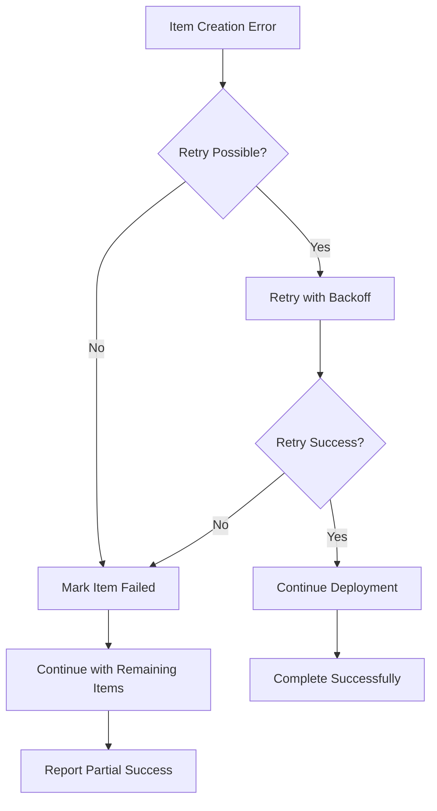
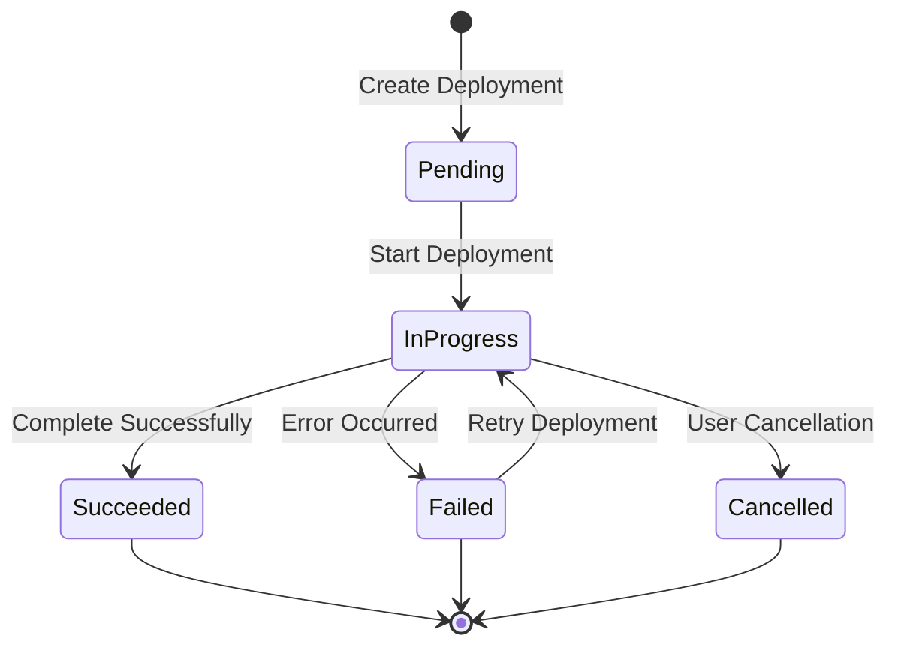

# PackageInstallerItem - Deployment Flow

## Deployment Strategy Architecture



## UX Deployment Strategy Flow

### 1. Prerequisites Validation



### 2. Item Deployment Pipeline

```typescript
async deployPackage(package: Package, deployment: PackageDeployment) {
    // 1. Workspace Setup
    const workspace = await this.setupWorkspace(deployment.workspace);
    
    // 2. Folder Setup (if required)
    const folder = await this.setupFolder(workspace, deployment.workspace?.folder);
    
    // 3. Deploy Items
    for (const item of package.items) {
        const deployedItem = await this.deployItem(item, workspace, folder);
        deployment.deployedItems.push(deployedItem);
        
        // Real-time progress update
        this.updateProgress(deployment, deployedItem);
    }
    
    // 4. Deploy Data Files
    await this.deployDataFiles(package.data, workspace);
    
    // 5. Run Post-Deployment Jobs
    await this.runOnFinishJobs(deployment.onFinishJobs);
}
```

### 3. Real-time Progress Tracking

- **Item Creation**: Track individual item creation status
- **Definition Updates**: Monitor definition part uploads
- **Data Upload**: Track OneLake file upload progress
- **Error Recovery**: Handle and retry failed operations
- **User Notifications**: Real-time status updates in UI

## Spark Notebook Deployment Strategy Flow

### 1. Notebook Generation



### 2. Job Execution Pipeline

```typescript
async deployViaSpark(package: Package, deployment: PackageDeployment) {
    // 1. Create deployment notebook
    const notebook = await this.generateDeploymentNotebook(package, deployment);
    
    // 2. Upload notebook to workspace
    const notebookItem = await this.uploadNotebook(notebook, deployment.workspace);
    
    // 3. Submit Spark job
    const job = await this.sparkClient.submitJob({
        notebookId: notebookItem.id,
        parameters: {
            packageId: package.id,
            deploymentId: deployment.id,
            workspaceId: deployment.workspace.id
        }
    });
    
    // 4. Monitor job execution
    deployment.job = {
        id: job.id,
        item: notebookItem,
        startTime: new Date(),
        status: job.status
    };
    
    // 5. Poll for completion
    await this.monitorJobExecution(deployment);
}
```

### 3. Job Monitoring

- **Status Polling**: Regular job status checks
- **Progress Parsing**: Extract progress from job logs
- **Error Detection**: Identify and report job failures
- **Result Processing**: Parse deployment results from job output
- **Timeout Handling**: Handle long-running job scenarios

## Deployment Configuration Options

### Workspace Configuration

```typescript
interface WorkspaceConfig {
    createNew: boolean;
    id?: string;              // For existing workspace
    name?: string;            // For new workspace
    description?: string;
    capacityId?: string;      // F-SKU capacity assignment
    folder?: FolderConfig;    // Optional folder organization
}
```

### Deployment Types

#### UX Deployment
- **Use Case**: Interactive deployments, immediate feedback required
- **Best For**: Small to medium packages, development scenarios
- **Characteristics**: Real-time progress, direct API calls, immediate error handling

#### Spark Notebook Deployment
- **Use Case**: Large packages, automated pipelines, batch processing
- **Best For**: Production deployments, scheduled installations
- **Characteristics**: Asynchronous execution, scalable processing, job monitoring

## Error Handling Strategies

### UX Deployment Errors



### Spark Deployment Errors

- **Job Submission Failures**: Validate notebook and parameters before submission
- **Execution Errors**: Parse job logs for specific error details
- **Timeout Handling**: Implement job cancellation for stuck executions
- **Resource Constraints**: Handle capacity and quota limitations

## Performance Optimization

### UX Strategy Optimizations
- **Parallel Processing**: Deploy multiple items concurrently
- **Batch Operations**: Group similar operations together
- **Progress Batching**: Update UI progress efficiently
- **Resource Management**: Optimize API call patterns

### Spark Strategy Optimizations
- **Job Bundling**: Package multiple deployments in single job
- **Data Locality**: Optimize data placement for Spark processing
- **Resource Allocation**: Right-size Spark cluster for package size
- **Monitoring Efficiency**: Optimize job status polling intervals

## Deployment Status Management

### Status Transitions



### Status Persistence
- **Database Storage**: Deployment history and status tracking
- **Real-time Updates**: Live status synchronization across UI
- **Audit Trail**: Complete deployment history with timestamps
- **Recovery Information**: Data needed for retry operations

## Integration Points

### Fabric Platform APIs
- **Items API**: Create and manage Fabric items
- **Workspaces API**: Workspace and folder management
- **OneLake API**: Data file upload and management
- **Capacity API**: F-SKU capacity assignment

### External Services
- **Spark Livy**: Job submission and monitoring
- **Notification Service**: User alerts and status updates
- **Authentication**: AAD integration for secure access
- **Logging**: Comprehensive deployment audit trails